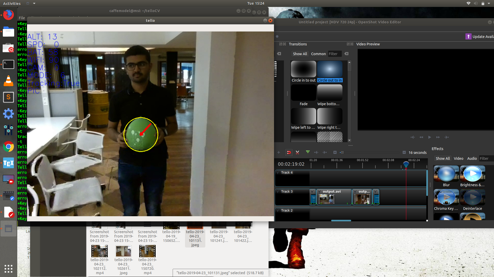

# TelloCV Target Tracker
This code provides a tracking algorithm for DJI-Tello. Targets are tracked in HSV color space. There is no learning involved in this project. Hardcoded for green balls for now, but the masks can be changed as per requirements.

## Dependancies
You need to have TelloPy and OpenCV installed in your system. You could either do a simple pip3 installation:

```
sudo pip3 install imutils pynput opencv-python tellopy
```
or compile from source if you want to use other features of the library. You could also compile `tellopy` from source like this:


```
git clone https://github.com/hanyazou/TelloPy
cd TelloPy
python setup.py bdist_wheel
pip install dist/tellopy-*.dev*.whl --upgrade
```

# Flight Rules
- Although tellos are very safe to operate, wear safety glasses as an added precaution
- Do not fly over people
- Memorize the controls *before* taking off. The controls are mentioned in the tracking codes.
- Always be ready to land the drone (backspace)
- If the program crashes restart it to regain control
- If drone is going out of control just hit it and it will turn off.


## Recording Videos
Press `R` to toggle recording and press again to finish. The recorded videos and pictures are saved in  <home>/Pictures


